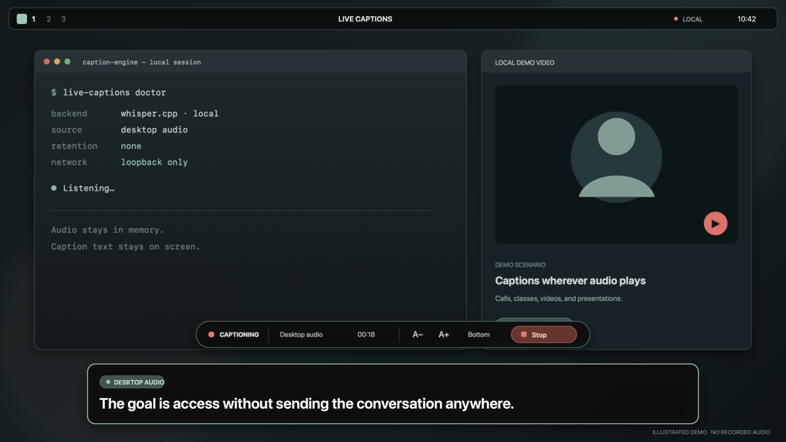

# Live Captions for Omarchy

If your computer can hear it, you should be able to read it.

Live Captions turns microphone or desktop audio into readable text across every Omarchy display. Whisper runs on your machine. The plugin saves neither the audio nor a transcript.

Choose one source. Press Start. Keep working.



## Try it

Omarchy plugins run inside the long-lived shell without a sandbox, so review this repository before installing it.

```bash
omarchy plugin add https://github.com/josephbriones/omarchy-live-captions.git --enable
```

The deterministic demo needs no audio device, model, or transcription engine:

```bash
omarchy-shell shell summon io.github.josephbriones.live-captions '{"demo":true}'
```

It uses fixed sample captions and never starts `pw-record` or `whisper-server`.

## Deliberately small

- One source per session: microphone **or** desktop audio, never a hidden mix.
- One local model, kept warm while captions are running.
- No cloud API, account, analytics, saved recording, or transcript archive.
- No automatic package install, model download, or rewrite of Omarchy, Hyprland, or PipeWire configuration.
- No always-on capture. Opening the overlay checks setup; only an explicit **Start** action opens audio.

Captions arrive after a four-second audio window plus local inference. Adjacent windows overlap by one second so boundary words are less likely to disappear. This is rolling local captioning, not sub-second broadcast transcription.

## Set up real captions

You need:

- a current Omarchy release with Quattro plugins;
- `pw-record`, already supplied by Omarchy's PipeWire stack;
- `whisper-server` from `whisper.cpp` 1.7.6 or newer;
- a local `whisper.cpp` GGML model.

Live Captions can discover several common local model caches, including compatible models already downloaded for VoxType. [The setup guide](docs/SETUP.md) has the Omarchy package command, a pinned model option, and verification steps.

Check readiness without opening an audio device:

```bash
~/.config/omarchy/plugins/io.github.josephbriones.live-captions/bin/live-captions doctor
```

If no model is found, preview the plugin-only preference change:

```bash
~/.config/omarchy/plugins/io.github.josephbriones.live-captions/bin/live-captions configure \
  --model /absolute/path/to/ggml-model.bin \
  --source microphone
```

Apply it only after reviewing the preview:

```bash
~/.config/omarchy/plugins/io.github.josephbriones.live-captions/bin/live-captions configure \
  --model /absolute/path/to/ggml-model.bin \
  --source microphone \
  --apply
```

That writes only `$XDG_CONFIG_HOME/omarchy/live-captions/config.json`. To override it for every caption run in the current shell process, set `LIVE_CAPTIONS_MODEL` or `LIVE_CAPTIONS_LANGUAGE` in the environment that launches `omarchy-shell`. The override lasts until that shell is restarted.

## Use it

Open or close the overlay:

```bash
omarchy-shell shell toggle io.github.josephbriones.live-captions
```

Select **Microphone** to caption the default PipeWire input, or **Desktop audio** to caption the default output's monitor stream. Then press **Start captions**. A visible indicator remains on screen for the entire capture.

The overlay puts click-through caption cards on every display and keeps its controls on the focused display. You can pause, stop, move captions to the top or bottom, change text size, and choose how many lines remain visible.

Direct IPC uses the same controls as the UI:

```bash
omarchy-shell io.github.josephbriones.live-captions start
omarchy-shell io.github.josephbriones.live-captions pause
omarchy-shell io.github.josephbriones.live-captions resume
omarchy-shell io.github.josephbriones.live-captions stop
omarchy-shell io.github.josephbriones.live-captions state
```

`start` returns `not-ready` until the overlay's local check passes. These methods act on an already-open plugin; summon it first.

To add a shortcut, put a binding in your own Hyprland bindings file:

```lua
o.bind("SUPER + ALT + C", "Live captions", "omarchy-shell shell toggle io.github.josephbriones.live-captions")
```

The plugin does not edit your bindings.

## Remove it

Stop captions, then use Omarchy's normal removal path:

```bash
omarchy plugin remove io.github.josephbriones.live-captions
```

Removal leaves `whisper.cpp`, your model, and the small preferences file at `~/.config/omarchy/live-captions/config.json` alone.

## Development

Run portable validation:

```bash
bash scripts/validate.sh
```

On Omarchy, run the no-audio desktop acceptance path:

```bash
bash scripts/acceptance-test.sh
```

Real capture always needs an explicit flag and a human Start action:

```bash
bash scripts/acceptance-test.sh --real --source microphone
```

[Testing](docs/TESTING.md) covers the acceptance matrix. [Architecture](docs/ARCHITECTURE.md) explains the process and privacy boundaries.

## Limits in 0.1

- Captions arrive as stable rolling-window results, not partial words.
- Microphone and desktop audio cannot run simultaneously.
- Source labels describe the selected device; they do not identify speakers.
- Accuracy and latency depend on the model, language, hardware, and audio quality.

## License

[MIT](LICENSE) © 2026 Joseph Briones.
